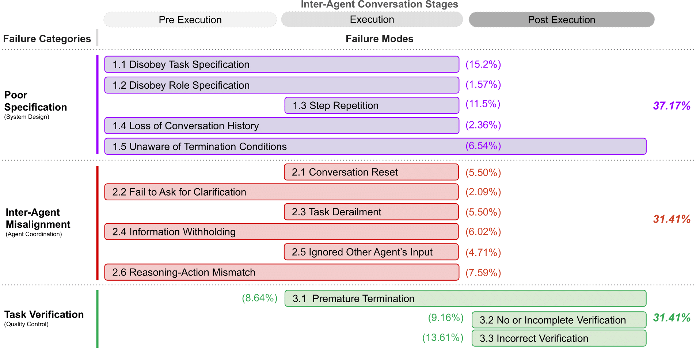

<p align="center">
  
</p>

This repository contains the code and the data for the paper "Why Do Multi-Agent Systems Fail?" https://arxiv.org/pdf/2503.13657


In this paper, we present the first comprehensive study of MAS challenges: MAST (Multi-Agent Systems Failure Taxonomy).




If you find this work useful, please cite it as follows:

```bibtex
@article{cemri2025multi,
  title={Why Do Multi-Agent LLM Systems Fail?},
  author={Cemri, Mert and Pan, Melissa Z and Yang, Shuyi and Agrawal, Lakshya A and Chopra, Bhavya and Tiwari, Rishabh and Keutzer, Kurt and Parameswaran, Aditya and Klein, Dan and Ramchandran, Kannan and others},
  journal={arXiv preprint arXiv:2503.13657},
  year={2025}
}
```
